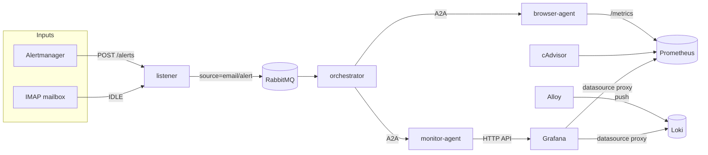
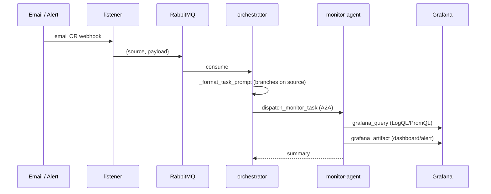
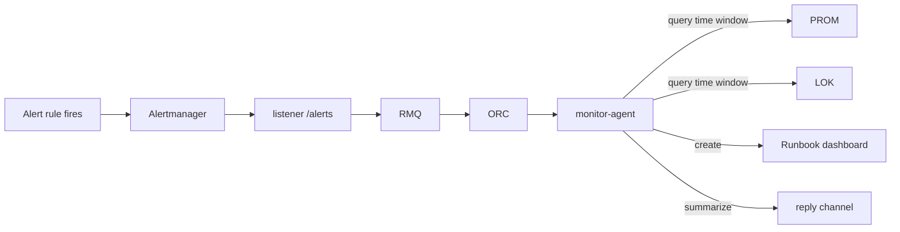
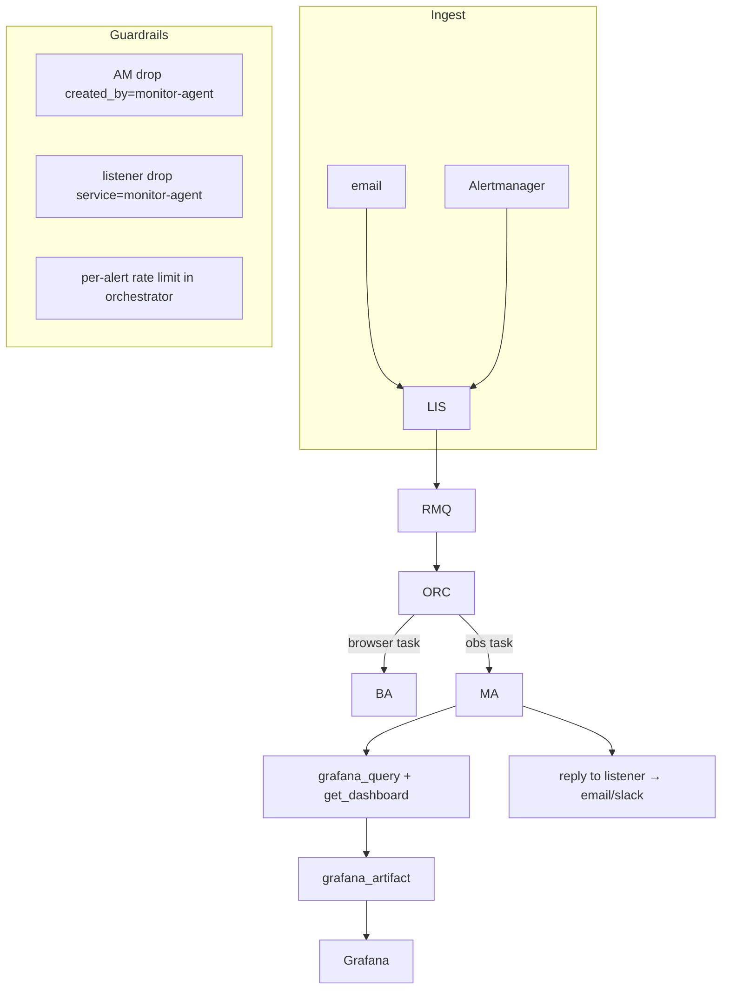

# Agentic RPA — Project Report

## 1. What the system is

An email-driven RPA platform where a Claude-powered orchestrator routes incoming tasks to specialized agents over the A2A protocol. A monitor-agent has been added so that Prometheus alerts and ad-hoc "show me X" requests both land on the same task queue.

## 2. Runtime topology

Services: `rabbitmq, listener, orchestrator, browser-agent, monitor-agent, prometheus, loki, alloy, grafana, alertmanager, cadvisor`.

## 3. Current task flow

## 4. Inconsistencies & smells

| # | Area | Finding | Severity |
|---|---|---|---|
| 1 | `monitoring/prometheus.yml` | `rule_files: /etc/prometheus/alert_rules.yml` references a file that doesn't exist and isn't mounted. Prometheus logs load errors on startup. | **High** — the alert pipeline is wired end-to-end but no rule ever fires. |
| 2 | End-to-end alert path | Loop guards, listener webhook, orchestrator alert branch, `dispatch_monitor_task` all exist, but with no rules it's never exercised in practice. | High |
| 3 | `tool_grafana_artifact.py` | Falls back to hardcoded `admin:admin` basic auth when `GRAFANA_API_KEY` is empty (which it is in compose). | Med |
| 4 | monitor-agent tools | No `get_dashboard` / `list_dashboards` tool → agent can't read-modify-write; must overwrite blind. This already bit us last session. | Med |
| 5 | `loki.yml` | `limits_config.reject_old_samples: false` is not a real key; correct one is `reject_old_samples_max_age`. Alloy still drops historical entries with 400. | Low |
| 6 | orchestrator | `_process_email` is misnamed after the email/alert split — should be `_process_task`. | Low |
| 7 | `prometheus.yml` | Commented-out monitor-agent scrape job left as dead comment. Either delete or have monitor-agent expose `/metrics` like browser-agent. | Low |
| 8 | `docker-compose.yml` | Observability services (prometheus, loki, alloy, grafana, alertmanager, cadvisor) have no `restart: unless-stopped`; the agents do. Inconsistent. | Low |
| 9 | `docker-compose.yml` | cAdvisor port `8088` exposed on host unnecessarily. No healthcheck on listener / alertmanager / prometheus / loki / alloy. | Low |
| 10 | Loop guard #2 | listener drops `service=monitor-agent` alerts, but monitor-agent isn't scraped and has no rules — currently dead code. Keep it, but note it's speculative. | Info |
| 11 | Tests | No `tests/` directory anywhere. The whole system relies on manual `docker compose up` smoke testing. | Med |
| 12 | Grafana creds | Admin password `admin` in compose — dev-only, document it. | Info |

## 5. What the monitor-agent is actually good for

Two use cases, both real:

**A. Autonomous incident triage (alert-driven)**

For every fired alert, build a "freeze-frame" dashboard at the alert's timestamp so the oncall has one link that already contains the relevant logs, CPU/mem, and the suspicious time range.

**B. Ad-hoc observability over email**

"How often did browser-agent error yesterday?" → orchestrator → monitor-agent → LogQL → reply + optional saved panel.

## 6. Proposed target data flow

Adds: a reply path, a `get_dashboard` tool, and a per-alert rate limit in the orchestrator (cheap, prevents a runaway LLM loop if loop guards are ever bypassed).

## 7. Concrete next steps (ordered, smallest first)

1. **Create `monitoring/alert_rules.yml`** with 3 starter rules — `BrowserAgentDown`, `BrowserAgentHighErrorRate`, `HighContainerMemory` — and mount it in compose. Without this, half the architecture is theater.
2. **Add `get_dashboard` + `list_dashboards` tools** to monitor-agent so updates are read-modify-write, not blind overwrite.
3. **Fix loki.yml** (`reject_old_samples_max_age: 168h`) so Alloy can ship existing container logs without 400s.
4. **Rate limiter in orchestrator** — reject dispatch if same `alertname` fired within the last N minutes. Belt-and-braces with the loop guards.
5. **Add a reply channel**: monitor-agent returns a structured result; orchestrator posts it back to listener (email reply) or Slack. Right now answers die in the orchestrator log.
6. **Expose monitor-agent `/metrics`** (copy the browser-agent pattern in `__main__.py:57-67`) and uncomment its scrape job — trivially unlocks loop-guard #2 and gives you agent self-observability.
7. **Delete hardcoded `admin:admin` fallback** in `tool_grafana_artifact.py` — fail loudly if no key is set; provision a service-account token via Grafana file provisioning instead.
8. **Smoke-test suite**: a `tests/smoke/` script that `docker compose up`s the stack, posts a fake alert to `listener:9000/alerts`, and asserts a new tagged dashboard shows up in Grafana. Cheap, catches 80% of regressions.
9. **Restart policy + healthchecks** on the observability stack for parity with the agents.
10. **Rename `_process_email` → `_process_task`** in `services/orchestrator/app/__main__.py:48`.

## 8. Summary

The skeleton is solid and coherent — A2A, the source discriminator, the two-guard loop protection, and the file-provisioned dashboards are all good choices. The main gap is that **the autonomous-triage loop is wired but never triggered** because no alert rules exist. Fixing #1 + #2 + #5 alone gets you a demonstrable end-to-end alert→dashboard flow, which is the project's headline capability.
