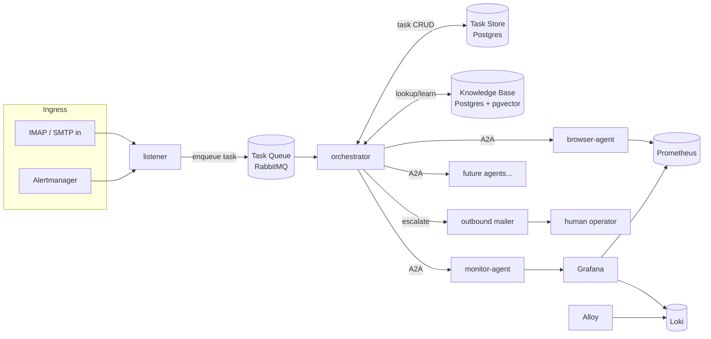
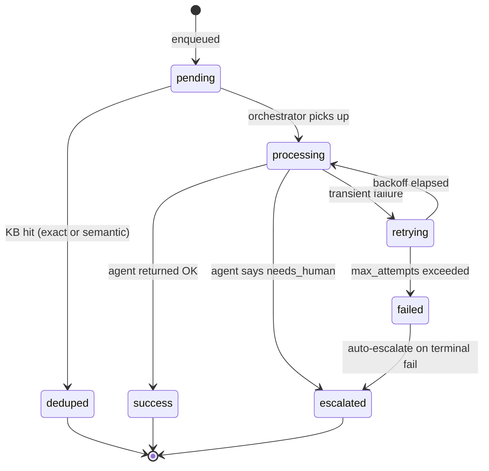
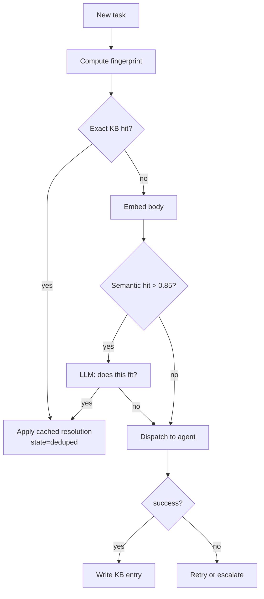
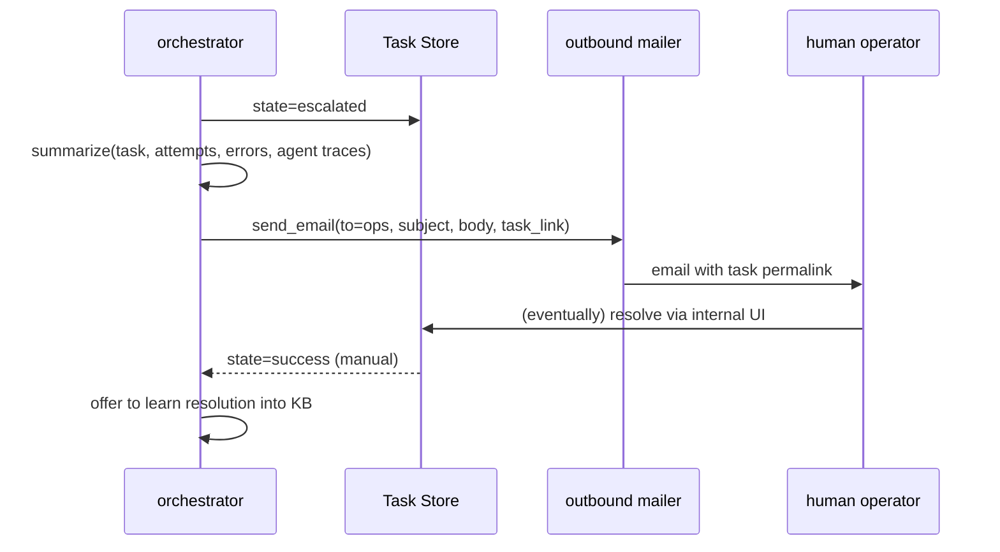
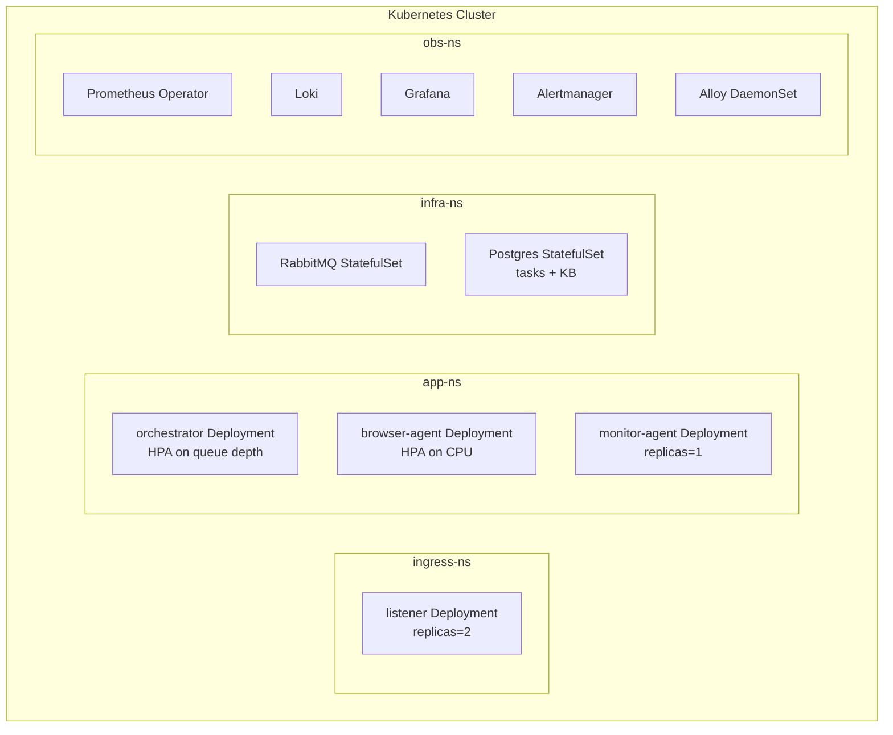

# Agentic RPA — Target Architecture

> Status: design doc. Describes the end-state APA (Agentic Process Automation) system. The current `docker-compose.yml` stack is the prototype; this document is the target we're evolving toward.

## 1. Goals

1. Consume a live stream of operational emails (logs, issues, requests) for a Moroccan telecom provider.
2. Resolve each email with the minimum amount of LLM reasoning — reuse prior solutions, don't re-think repeat problems.
3. Track every task's lifecycle durably so nothing silently disappears.
4. Retry transient failures; escalate permanent ones to a human with a concise summary.
5. Observe everything (metrics, logs, traces, task state) from one place.
6. Deploy to Kubernetes and scale horizontally on queue depth.

## 2. High-level topology



## 3. Task lifecycle

Every inbound email or alert becomes a **Task** row in Postgres. The task is the single source of truth — the queue only carries its ID.

### 3.1 State machine



### 3.2 Task row (Postgres)

```sql
CREATE TABLE tasks (
  id            UUID PRIMARY KEY,
  source        TEXT NOT NULL,          -- email | alert | api
  external_id   TEXT,                    -- IMAP message-id / alert fingerprint
  fingerprint   TEXT NOT NULL,           -- hash used for KB dedup
  payload       JSONB NOT NULL,
  state         TEXT NOT NULL,           -- pending|processing|retrying|success|failed|escalated|deduped
  attempt       INT  NOT NULL DEFAULT 0,
  max_attempts  INT  NOT NULL DEFAULT 5,
  assigned_to   TEXT,                    -- agent name
  result        JSONB,
  error         TEXT,
  kb_entry_id   UUID REFERENCES kb_entries(id),
  created_at    TIMESTAMPTZ NOT NULL DEFAULT now(),
  updated_at    TIMESTAMPTZ NOT NULL DEFAULT now(),
  next_attempt_at TIMESTAMPTZ
);

CREATE INDEX tasks_state_idx ON tasks (state, next_attempt_at);
CREATE INDEX tasks_fingerprint_idx ON tasks (fingerprint);
```

State transitions happen in a transaction together with the queue ack — no split-brain between "queue says done" and "DB says processing".

## 4. Knowledge base (dedup + learning)

Two levels of matching:

**Level 1 — exact fingerprint.** Hash of `(sender_domain, normalized_subject, error_signature, primary_entities)`. Normalize: lowercase, strip IDs/timestamps/ticket numbers. If the same fingerprint has a prior `success`, reuse the resolution verbatim — no LLM call at all.

**Level 2 — semantic similarity.** Embed the email body with a small model, store in `pgvector`. On miss at level 1, do a top-k cosine lookup. If similarity > threshold and the candidate's resolution is still valid, apply it with a light LLM verification step ("does this prior resolution fit this new problem? yes/no + why").

### 4.1 KB schema

```sql
CREATE TABLE kb_entries (
  id            UUID PRIMARY KEY,
  fingerprint   TEXT UNIQUE NOT NULL,
  embedding     VECTOR(768),
  problem       TEXT NOT NULL,           -- distilled problem statement
  resolution    JSONB NOT NULL,          -- structured steps / agent call sequence
  confidence    REAL NOT NULL,           -- 0..1, decays without reuse
  hit_count     INT NOT NULL DEFAULT 0,
  last_used_at  TIMESTAMPTZ,
  created_by    TEXT NOT NULL,           -- 'agent' | 'human'
  created_at    TIMESTAMPTZ NOT NULL DEFAULT now()
);

CREATE INDEX kb_embedding_idx ON kb_entries USING ivfflat (embedding vector_cosine_ops);
```

### 4.2 Write path

An entry is created when a task completes `success` AND (fingerprint is new OR existing entry's confidence < threshold). The orchestrator asks the resolving agent to emit a structured `resolution` blob, not just freeform text.

### 4.3 Resolution flow



## 5. Retries

Retries live **at the orchestrator + queue layer**, not inside agents. Agents should be stateless and idempotent; if they fail, the orchestrator decides what to do next.

### 5.1 Mechanism

- RabbitMQ has a **main queue**, a **retry queue** with per-message TTL, and a **dead-letter queue** for escalation.
- On transient failure, orchestrator writes `state=retrying`, computes `next_attempt_at` with exponential backoff + jitter, and republishes the task ID to the retry queue with TTL = backoff.
- On TTL expiry, the message flows back to the main queue automatically (RabbitMQ DLX).
- On `attempt >= max_attempts`, orchestrator transitions to `failed` → auto-escalate.

### 5.2 Classifying failures

The orchestrator classifies each error before deciding:

| Class | Example | Action |
|---|---|---|
| Transient infra | HTTP 5xx, timeout, RabbitMQ disconnect | retry with backoff |
| Rate limit | 429, Anthropic overload | retry with longer backoff |
| Invalid input | malformed payload | fail immediately, escalate |
| Needs human | agent explicitly returns `needs_human=true` | escalate, don't retry |
| Unknown | anything else | retry once, then escalate |

## 6. Human escalation



The escalation email must contain: task ID, original request, what was tried, why it failed, a permalink to the task's full state. Keep it skimmable — the operator should make the accept/reject call in under 30 seconds.

## 7. Observability

| Layer | Source | Sink |
|---|---|---|
| Metrics | agents `/metrics`, cAdvisor, RabbitMQ exporter, Postgres exporter | Prometheus |
| Logs | container stdout (structured JSON) | Alloy → Loki |
| Traces | OpenTelemetry SDK in each agent | Tempo (new) |
| Task state | Postgres `tasks` table | Grafana Postgres datasource |
| Alerts | Prometheus rules | Alertmanager → listener → orchestrator → monitor-agent (triage loop) |

### 7.1 Self-observability loop

The monitor-agent watches the task table itself — alerts fire on things like `tasks_failed_rate_5m > 0.1` or `retry_queue_depth > 100`. These feed back into the same ingress as customer alerts, using the two-guard loop protection already in place.

## 8. Kubernetes deployment



### 8.1 Scaling rules

| Component | Scale signal | Notes |
|---|---|---|
| listener | fixed 2 replicas | IMAP IDLE only needs 1 active; second is HA standby via leader election or external mailbox lock |
| orchestrator | KEDA on RabbitMQ queue depth | stateless, easy to scale |
| browser-agent | HPA on CPU + concurrent A2A sessions | each pod holds a Playwright browser, so scaling = more pods, not more threads |
| monitor-agent | 1 replica | single-writer to Grafana; low load |
| rabbitmq | StatefulSet, 3 nodes | quorum queues for durability |
| postgres | StatefulSet with replication | or managed Cloud SQL / RDS equivalent |

### 8.2 What k8s unlocks that compose can't

- **KEDA-based scaling** on queue depth — the orchestrator count matches the incoming workload.
- **PodDisruptionBudgets** so rolling restarts don't empty the queue workers all at once.
- **Secrets via external-secrets-operator** — no more `.env` files, credentials come from Vault / cloud KMS.
- **Network policies** — lock the agents off from everything except RabbitMQ, Postgres, and the specific upstream APIs they need.
- **Per-agent resource limits** — browser-agent gets generous memory, orchestrator gets little, monitor-agent gets tiny.

## 9. What changes in the existing code

Minimum changes to get from today's prototype to this target:

| Area | Change |
|---|---|
| listener | Write to `tasks` table first, then publish task **ID** (not full payload) to RabbitMQ. |
| orchestrator | Load task by ID, classify, consult KB before dispatching, own the state transitions, own retries via DLX. |
| orchestrator | Split `_process_task` into `_classify`, `_dedup`, `_dispatch`, `_finalize`, `_escalate`. |
| orchestrator | Add outbound mailer for escalation. Could reuse `listener` infra or be its own `mailer` service. |
| agents | Return structured results: `{status, needs_human, resolution_steps, error_class}`. No more freeform text as the contract. |
| monitor-agent | Add `get_dashboard` tool (already in the roadmap). Add alert rules for task-store health. |
| new | `kb-service` — small FastAPI wrapper around Postgres + pgvector. Keeps embedding logic in one place. |
| new | `task-api` — optional read-only HTTP API for a future ops UI. |
| infra | Add Postgres to compose now so we can develop against it before the k8s move. |
| infra | Add Tempo for tracing if/when we want per-task traces. |

## 10. Phased migration plan

**Phase 1 — state + retries (2 weeks of work).** Add Postgres, task table, orchestrator owns state, DLX retries, fail→escalate via email. *Outcome:* nothing is lost, retries work, humans get notified.

**Phase 2 — KB level 1 (1 week).** Fingerprint hashing, exact-match cache, write on success. *Outcome:* measurable drop in LLM calls for repeat issues.

**Phase 3 — KB level 2 (2 weeks).** pgvector, embeddings, semantic lookup, verification step. *Outcome:* handles paraphrased repeats, not just identical ones.

**Phase 4 — k8s move (2 weeks).** Helm charts, KEDA, secrets, network policies, managed Postgres. *Outcome:* horizontally scalable production deployment.

**Phase 5 — tracing + ops UI (ongoing).** OTel, Tempo, a small frontend for the task table + KB curation. *Outcome:* operators can see and edit state.

## 11. Open questions

1. **Postgres vs separate stores?** Putting `tasks` and `kb_entries` in one Postgres is simple but couples their lifecycles. Acceptable for now; revisit if KB grows past a few million rows.
2. **Embedding model?** Local (sentence-transformers) vs hosted. Local avoids latency + cost; hosted (Voyage, OpenAI) is higher quality. Start local, measure recall.
3. **KB confidence decay?** How aggressively should unused entries expire? Proposal: halve confidence every 90 days of no hits; drop below 0.3 → require re-verification.
4. **Who writes KB entries — the resolving agent or a post-hoc summarizer?** Resolving agent is cheaper but lower quality. Proposal: resolving agent drafts, a small summarizer pass cleans up.
5. **How do we handle emails that aren't tasks at all** (spam, replies, out-of-office)? Needs a pre-classifier step in the listener or orchestrator.

## 12. Non-goals (for now)

- A custom agent framework. We stay on Claude Agent SDK + A2A.
- Multi-tenant isolation. One telecom provider, one deployment.
- Real-time (sub-second) SLAs. Tasks finishing in seconds-to-minutes is fine.
- Replacing RabbitMQ with Kafka. Queue depth is low; ordering isn't critical.
